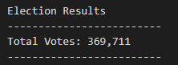
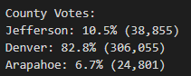
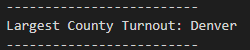
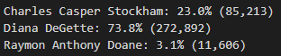
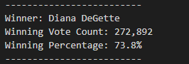

# Election Analysis

## Overview of Election Audit

## Election-Audit Results

### 1. How many votes were cast in this congressional election?
Ans: The total number of votes cast in this congressional election is **369,711**.

### 2. Provide a breakdown of the number of votes and the percentage of total votes for each county in the precinct
Ans: Given below is the breakdown of number and percentage of votes in each county.
* Jefferson : 38,855 votes (10.5% of total)
* Denver : 306,055 votes (82.8% of total)
* Arapahoe : 24,801 votes (6.7% of total)

### 3. Which county had the largest number of votes?
Ans: The county with largest number of votes is **Denver**.

### 4. Provide a breakdown of the number of votes and the percentage of the total votes each candidate received.
Ans: Please find below the total and percentage of votes each candidate received.
* Charles Casper Stockham : 85,213 votes (23.0% of total)
* Diana DeGette : 272,892 votes (73.8% of total)
* Raymon Anthony Doane : 11,606 votes (3.15 of total)

### 5. Which candidate won the election, what was their vote count, and what was their percentage of the total votes?
Ans: The details of the winning candidates are:
* Name of Winner : Diana DeGette
* Vote Count for Winner : 272,892
* Percentage of Votes : 73.8% 

## Election-Audit Summary