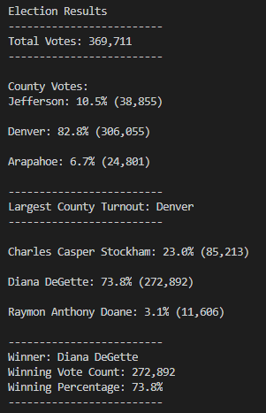
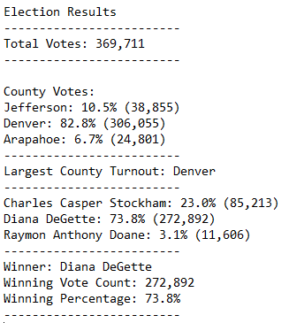

# Election Analysis

## Overview of Election Audit

### Background
I am assisting a Colorado Board of Elections employee in election audit of tabulated results for a US Congressional precinct in Colorado. The election data is provided in a CSV file with following columns:

* Ballot ID
* County
* Candidate

### Purpose
 Our task is to find:
1. The total number votes cast in this elections
2. The total number of votes for each candidate
3. The percentage of votes for each candidate
4. Determine the winner of the election
5. Total number of votes for each county
6. Percentage of votes for each county
7. Determine county with largest turnout   

### Resources
- Data Source: election_results.csv
- Software: Python 3.7.6; Visual Studio Code 1.52.1
## Election-Audit Results

### Command Line Output



### TXT File Output



* How many votes were cast in this congressional election?
   
    *Answer:* The total number of votes cast in this congressional election is **369,711**
    

* Provide a breakdown of the number of votes and the percentage of total votes for each county in the precinct

    *Answer:* Given below is the breakdown of number and percentage of votes in each county.

    ```
    Jefferson: 38,855 votes (10.5% of total votes)
    Denver: 306,055 votes (82.8% of total votes)
    Arapahoe: 24,801 votes (6.7% of total votes)
    ```
* Which county had the largest number of votes?

    *Answer:* The county with largest number of votes is **Denver**.

* Provide a breakdown of the number of votes and the percentage of the total votes each candidate received.

    *Answer:* Please find below the number and percentage of votes each candidate received.

    ```
    Charles Casper Stockham: 85,213 votes (23.0% of total votes)
    Diana DeGette: 272,892 votes (73.8% of total votes)
    Raymon Anthony Doane: 11,606 votes (3.1% of total votes)
    ```

* Which candidate won the election, what was their vote count, and what was their percentage of the total votes?

   *Answer:* The details of the winning candidates are:
    ```
    Winner: Diana DeGette
    Winning Vote Count: 272,892
    Winning Percentage: 73.8%
    ```
## Election-Audit Summary

The script used to analyze the election data for Colorado Board of Elections is versatile and efficient. It can be used to analyze hundreds of thousands of data elements in few seconds. The script is written in Python, which is one of the most widely used programming language in the world. 

This script can be used to analyze not only the current Congressional elections but any other elections with few modifications. For e.g.:

 1. The script can be used for *Senatorial Elections*. In this case, we will have data for  senatorial districts instead of congressional districts/precincts. However, the basic code will remain the same because the method used to determine the winner is same in both types of elections. I.e. based on popular votes. The script will still be able to count the number (and percentage) of votes for each candidate. Also, the script will be able to determine the counties or citites with hightest turnout. Only this case the number of counties in each senatorial district will be different from those in congressional district.
 
    Similarly, the script can be used for *Local Elections* as well. In this case, instad of counties, we will have zones. 

 2. In an election, there are different types of *voting methods*. For e.g., in the Congressional Elections analyzed earlier, there were three voting methods: 
    * Mail-In Ballots 
    * Punch Cards 
    * Direct Recording Electronic (DRE) Machines.  

    Using the coding pattern we earlier used to count the number of votes and percentage of votes for each county, we can count 
    
    * The number of votes cast through a voting method
    * The percentage of votes cast through each voting method
    * The most widely used (or least used) voting method 
    
    However, this will require the voting method of each Ballot ID to be listed in the election results dataset.

3. In case some additional data about voters or candidates are given in the election results dataset, we can use the same script with few additional modifications to analyze the voting patterns and preferences. For e.g.,

    * Demographic Data: In case certain demographic details (gender or age-group) about each Ballot Id are available, we can analyze which demographic group votes most actively. Or, with some further modifications, which candidate is popular among certain demography.
    * In case more than one candidates in contest from a political party, we can edit the script to determine which party received the highest number of votes, apart from vote counts for each candidate. In this case, additional column about party of each candidate will be required in the dataset. 


